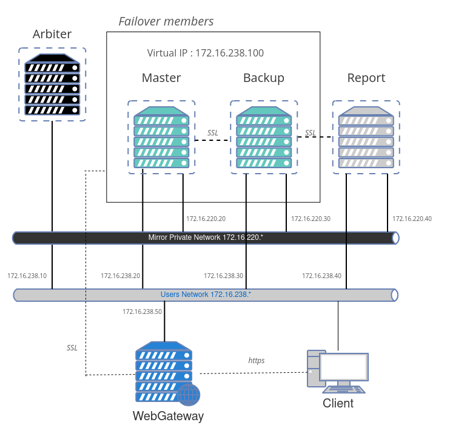
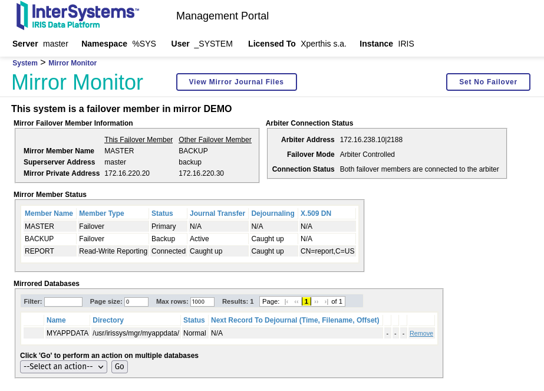
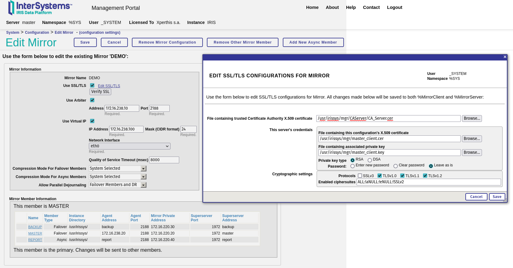

# IRIS Mirroring sample

In this repository we can find a sample to create mirroring fully scripted without manual intervention.  

We use IRIS, ZPM Package manager and docker.  

This sample includes : arbiter, 2 failover members, 1 report asynch node, webgateway, https, ssl\tls configuration.  




## Prerequisites

 * [Mirroring knowledge](https://docs.intersystems.com/irislatest/csp/docbook/DocBook.UI.Page.cls?KEY=GHA_mirror).  
 * WRC Access.  
 * tls-ssl-webgateway image (see repo [tls-ssl-webgateway](https://github.com/lscalese/tls-ssl-webgateway) to build this image)

## Prepare your system

### Get an IRIS License

If you don't have a valid Docker License for IRIS yet connect to [Worldwide Respnse Center (WRC)](https://wrc.interystems.com) with your credentials.  
Click "Actions" --> "Online distribtion", then "Evaluations" button and select "Evaluation License", fill the form.  
Copy the `iris.key` to this repository directory.  


### Create users and groups

This sample use a local directory as a volume to share database file `IRIS.DAT` between containers.  
We need to set security settings to `./backup` directory.  
If irisowner, irisuser groups and users does not exists yet on your system, create them.  

```bash
sudo useradd --uid 51773 --user-group irisowner
sudo groupmod --gid 51773 irisowner
sudo chgrp irisowner ./backup
```

### Login to Intersystems Containers Registry

Our [docker-compose.yml](./docker-compose.yml) uses references to `containers.intersystems.com`.  
So you need to login to Intersystems Containers Registry to pull the used images.  
If you don't remember your password for the docker login to ICR, open this page https://login.intersystems.com/login/SSO.UI.User.ApplicationTokens.cls and you can retrieve your docker token.  


```bash
docker login -u="YourWRCLogin" -p="YourPassWord" containers.intersystems.com
```

### Generate certificates

If you don't have your own certificates, use this script to generate all needed certificate files : 

```
docker pull intersystemsdc/iris-community:latest
cd ./generator
# sudo is needed due chown, chgrp, chmod ...
sudo ./gen-certificates.sh
# move certificate for apache webserver to the home directory.  
mkdir -vp ~/webgateway-apache-certificates
mv -vn ./certificates/apache_webgateway.cer ~/webgateway-apache-certificates/apache_webgateway.cer
mv -vn ./certificates/apache_webgateway.key ~/webgateway-apache-certificates/apache_webgateway.key
cd ..
```

Generated certficates will be in `./certificates` directory for IRIS instances and webgateway component.  
The certificate and the private for apache webserver will be in your home directory `~/webgateway-apache-certificates`.  
If files alread exist, they won't be overrided.  

Using a new generated a certificate for each try on the webserver could cause an error `Certificate contains the same serial number as another certificate`.  
See troubleshoot section to fix it if you encounter this problem.  

Certficates files overview : 

| File | Container | Description |
|--- |--- |--- |
| ~/webgateway-apache-certificates/apache_webgateway.cer | webgateway | Certificate for apache webserver |
| ~/webgateway-apache-certificates/apache_webgateway.key | webgateway | Related private key |
| ./certificates/webgateway_client.cer | webgateway | Certificate to encrypt communication between webgateway and IRIS |
| ./certificates/webgateway_client.key | webgateway | Related private key |
| ./certificates/CA_Server.cer | webgateway,master,backup,report | Authority server certificate|
| ./certificates/master_server.cer | master | Certificate for IRIS master instance (used for mirror and wegateway communication encryption) |
| ./certificates/master_server.key | master | Related private key |
| ./certificates/backup_server.cer | backup | Certificate for IRIS backup instance (used for mirror and wegateway communication encryption) |
| ./certificates/backup_server.key | backup | Related private key |
| ./certificates/report_server.cer | report | Certificate for IRIS report instance (used for mirror and wegateway communication encryption) |
| ./certificates/report_server.key | report | Related private key |


### Build and run containers

```
sudo docker-compose build --no-cache
docker-compose up
```

Wait each instance has the good mirror status.  It takes a while...
You should see theses messages in docker logs :  

```
mirror-demo-master | 01/09/22-11:02:08:227 (684) 1 [Utility.Event] Becoming primary mirror server
...
mirror-demo-backup | 01/09/22-11:03:06:398 (801) 0 [Utility.Event] Found MASTER as primary, becoming backup
...
mirror-demo-report | 01/09/22-11:03:10:745 (736) 0 [Generic.Event] MirrorClient: Connected to primary: MASTER (ver 4)
```

### Test

See the mirror monitor (management portal, this is the default user and password.) : http://localhost:81/csp/sys/op/%25CSP.UI.Portal.Mirror.Monitor.zen  


See the mirror settings : http://localhost:81/csp/sys/mgr/%25CSP.UI.Portal.Mirror.EditFailover.zen?$NAMESPACE=%25SYS  




We can test by simply set a global starting by `demo.`

Open a terminal session on primary server : 

```bash
docker exec -it mirror-demo-master irissession iris
```
```ObjectScript
s ^demo.test = $zdt($h,3,1)
```

Check if the data is available on backup node : 

```bash
docker exec -it mirror-demo-backup irissession iris
```
```ObjectScript
W ^demo.test
```

Check if the data is available on report node : 

```bash
docker exec -it mirror-demo-report irissession iris
```
```ObjectScript
W ^demo.test
```


## Access to portals

Master : http://localhost:81/csp/sys/utilhome.csp  
Failover backup member : http://localhost:82/csp/sys/utilhome.csp  
Read-Write report async member : http://localhost:83/csp/sys/utilhome.csp  

Access to the primary node throughout WebGateway : https://localhost/csp/sys/utilhome.csp  
Access to the WebGateway management : https://localhost/csp/bin/Systems/Module.cxw  


# Troubleshoot

## Certificate contains the same serial number as another certificate

With firefox It could happen when we generate new Authority Certificate.  

Delete cert9.db file : ~/.mozilla/firefox/xktesjjl.default-release/cert9.db

Restart firefox and retry.  

